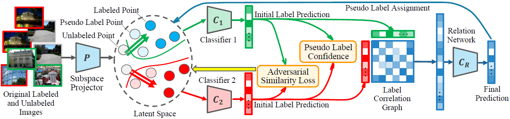

# Dual Relation Semi-supervised Multi-label Learning
This repository contains code for our AAAI Conference on Artificial Intelligence 2020 paper: [Dual Relation Semi-supervised Multi-label Learning](https://github.com/wanglichenxj/Dual-Relation-Semi-supervised-Multi-label-Learning/blob/master/presentation/AAAI20_MultiLabel.pdf) (DRML).

## Our paper
### Introduction
<div align="center">
    
</div>

Multi-label learning (MLL) solves the problem that one single sample corresponds to multiple labels. It is a challenging task due to the long-tail label distribution and the sophisticated label relations. Semi-supervised MLL methods utilize a small-scale labeled samples and large-scale unlabeled samples to enhance the performance. However, these approaches mainly focus on exploring the data distribution in feature space while ignoring mining the label relation inside of each instance. 

### Our model
<div align="center">
    
</div>

We proposed a Dual Relation Semi-supervised Multi-label Learning (DRML) approach which jointly explores the feature distribution and the label relation simultaneously. A dual-classifier domain adaptation strategy is proposed to align features while generating pseudo labels to improve learning performance. A relation network is proposed to explore the relation knowledge. As a result, DRML effectively explores the feature-label and label-label relations in both labeled and unlabeled samples. It is an end-to-end model without any extra knowledge. Extensive experiments illustrate the effectiveness and efficiency of our method.

## Running the code
The code will be available soon. Feel free to send email if you have any questions!

## Authors
Welcome to send us Emails if you have any questions about the code and our work :-)
* **Lichen Wang** [Website](https://sites.google.com/site/lichenwang123/)
* **Yunyu Liu** [Website](http://allanding.net/)
* **Can Qin** [Website](https://scholar.google.com/citations?user=QCik-YcAAAAJ&hl=en)
* **Gan Sun** [Website](https://scholar.google.com/citations?user=U4a4FLIAAAAJ&hl=en)
* **Yun Raymond Fu** [Website](http://www1.ece.neu.edu/~yunfu/)

## Citation
Please cite our paper if you like or use our work for your research, thank you very much!
```
@inproceedings{DRML_AAAI20,
  title={Dual Relation Semi-supervised Multi-label Learning},
  author={Wang, Lichen and Liu, Yunyu and Qin, Can and Sun, Gan and Fu, Yun},
  booktitle={Proceedings of AAAI Conference on Artificial Intelligence},
  year={2020}
}
```
